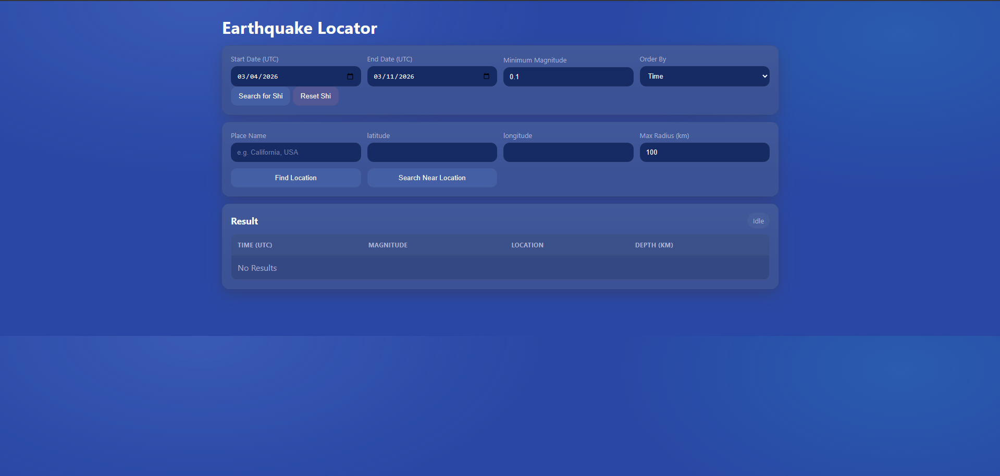
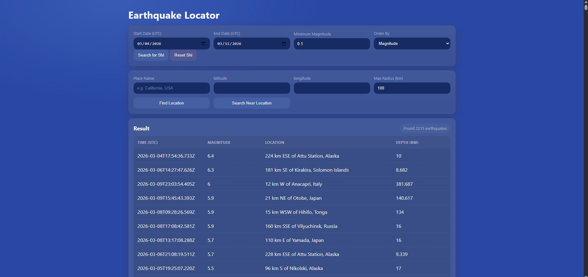
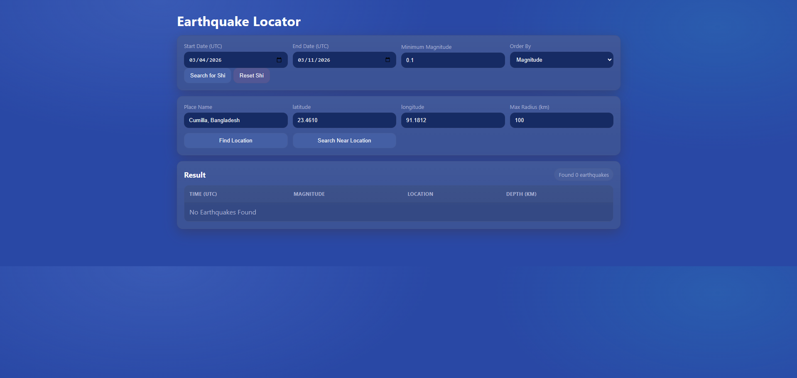

# Earthquake Locator

Earthquake locator is a flask app that uses the USGS Earthquake API to find earthquakes that happened in a particular timespan

It can find all the earthquakes that happened in the world at that time or just the earthquakes that happened in a certain radius from a location.

For the location you can input a city name or the latitude/longitude or you can automatically use your own location which is fetched using the JS geolocation API

# Screenshots

